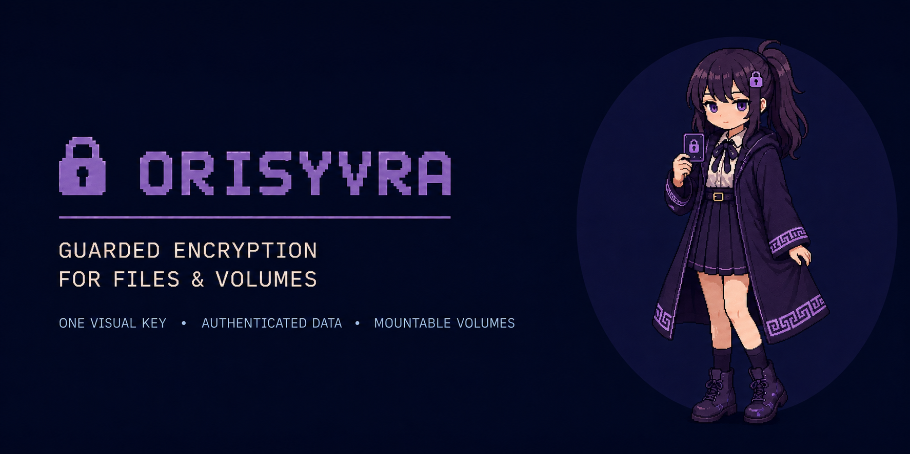
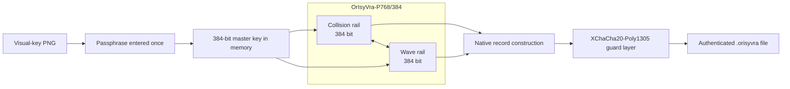

<div align="center">

# OrIsyVra-P768/K384/C384/T256-R18

### Collision–Wave Dual-Engine Authenticated Encryption

**Experimental cryptography research project and practical file-encryption application, written in Rust.**



<p>
  <a href="https://github.com/urotsuki-san/OrIsyVra/releases/tag/v0.2.0-alpha.1"></a>
  
  
  <a href="LICENSE"></a>
</p>

**[Download](https://github.com/urotsuki-san/OrIsyVra/releases/tag/v0.2.0-alpha.1)** · **[Quick start](#quick-start)** · **[Specification](docs/SPEC.md)** · **[Security](SECURITY.md)** · **[Encrypted volumes](docs/VOLUME.md)**

<sub>Short name: <strong>OrIsyVra</strong></sub>

</div>

---

> [!IMPORTANT]
> **Guarded Mode is the default.** Native Research Mode exposes the experimental OrIsyVra construction and is intended for cryptanalysis and research data.

## Download

<table>
<tr>
<td width="33%" align="center">
<strong>Windows</strong><br><br>
<a href="https://github.com/urotsuki-san/OrIsyVra/releases/tag/v0.2.0-alpha.1"><strong>OrIsyVra-Setup-x86_64.exe</strong></a><br>
<sub>File/folder GUI · Encrypted Volumes GUI · CLI · analysis tool</sub>
</td>
<td width="33%" align="center">
<strong>Linux x86-64</strong><br><br>
<a href="https://github.com/urotsuki-san/OrIsyVra/releases/tag/v0.2.0-alpha.1"><strong>tar.gz bundle</strong></a><br>
<sub>GUI · CLI · analysis tool</sub>
</td>
<td width="33%" align="center">
<strong>macOS Apple Silicon</strong><br><br>
<a href="https://github.com/urotsuki-san/OrIsyVra/releases/tag/v0.2.0-alpha.1"><strong>tar.gz bundle</strong></a><br>
<sub>GUI · CLI · analysis tool</sub>
</td>
</tr>
</table>

SHA-256 checksum files are included in the release assets.

## What changed in the application

<table>
<tr>
<td width="50%">
<h3>One visual key</h3>
The PNG visual key is the key itself. A second key-capsule file is not required for normal GUI use.
</td>
<td width="50%">
<h3>Unlock once</h3>
Enter the visual-key passphrase once. The unlocked master key remains only in memory until the application closes or you press Lock.
</td>
</tr>
<tr>
<td width="50%">
<h3>Digital key without QR dependency</h3>
The PNG stores its protected key in a private PNG chunk. QR remains only as a print/camera recovery path.
</td>
<td width="50%">
<h3>Guarded / Native switch</h3>
Choose Guarded Mode for normal data or explicitly acknowledge Native Research Mode for experiments.
</td>
</tr>
<tr>
<td width="50%">
<h3>File and folder workflow</h3>
Drop a file or folder, keep the automatic output path, and start. Folder structure is preserved during batch processing.
</td>
<td width="50%">
<h3>Windows encrypted drives</h3>
Create sparse encrypted-volume files, attach them through the WinSpd virtual-disk host, and optionally restore registered drives after Windows sign-in.
</td>
</tr>
</table>

## Quick start

### Desktop application

1. Start `orisyvra-gui`.
2. Drop a file or folder.
3. Create or choose one visual-key PNG.
4. Unlock it once with its passphrase.
5. Keep **Guarded** selected and press **Start encryption**.

The application remembers only the selected key path. It does not save the passphrase or the unlocked master key.

### Windows encrypted drive

The installer also provides **OrIsyVra Encrypted Volumes**.

1. Install a compatible WinSpd runtime and start `orisyvra-volume-gui`.
2. Choose the visual-key PNG and unlock it once.
3. Choose a logical capacity and preferred drive letter, then create the encrypted drive.
4. On the first attachment only, format the new Windows partition as NTFS or exFAT.
5. Use the mounted drive normally in Explorer and applications, then press **Unmount** before removing or moving the backing file.

Each registered volume can enable **Auto-mount at Windows sign-in**. The recommended mode prompts once for its visual key after sign-in and then mounts all configured volumes using that key. An optional fully automatic mode stores only a dedicated mount credential protected by Windows DPAPI for the current Windows account; the visual-key passphrase and raw master key are not written to disk. Temporary manual-mount credentials expire after five minutes and cannot be reused at a later sign-in.

The virtual-disk feature is still an alpha integration: the Windows build and installer are validated in CI, but broad real-machine compatibility testing with different Windows/WinSpd/filesystem/application combinations is still ongoing.

### Command line

Create one visual-key PNG:

```bash
orisyvra keygen -o my-key.png
```

Encrypt:

```bash
orisyvra encrypt report.pdf --key my-key.png
```

Decrypt:

```bash
orisyvra decrypt report.pdf.orisyvra --key my-key.png
```

Create a printable backup:

```bash
orisyvra keycard export --key my-key.png -o my-key-print.pdf
```

Create a recovery key protected by a different passphrase:

```bash
orisyvra keycard recovery --key my-key.png -o recovery-key.png
```

## Architecture



| Parameter | Value |
|---|---:|
| State | **768 bit** |
| Collision rail | **384 bit** |
| Wave rail | **384 bit** |
| Master key | **384 bit** |
| Capacity | **384 bit** |
| Native tag | **256 bit** |
| Rounds | **18** |
| Default chunk | **1 MiB** |

## Modes

| Mode | Intended use | Construction |
|---|---|---|
| **Guarded** | Normal use and practical testing | OrIsyVra Native + XChaCha20-Poly1305 |
| **Native Research** | Cryptanalysis and algorithm research | OrIsyVra native construction only |

Native Research Mode requires explicit acknowledgement in both the GUI and CLI.

## Encrypted volumes

The mountable-volume work is no longer design-only. **P2A is implemented** in [`crates/orisyvra-volume`](crates/orisyvra-volume):

- sparse containers with 64-bit logical capacity;
- authenticated random-access encrypted blocks;
- alternating authenticated A/B superblocks;
- generation-bound nonces and block-location binding;
- recovery that discards an uncommitted crash tail;
- tests for wrong keys, relocation/tampering, range violations, reopen, and sparse 100 GiB behavior.

The Windows alpha now also contains [`orisyvra-volume-gui`](crates/orisyvra-volume-gui) and the WinSpd-backed `orisyvra-volume-mount` host. OrIsyVra exposes authenticated logical sectors through a virtual SCSI disk and lets Windows use its own NTFS/exFAT stack rather than reimplementing Windows filesystem semantics.

```text
vault.orisyvra-volume
        ↓
OrIsyVra authenticated block layer
        ↓
WinSpd virtual SCSI disk
        ↓
Windows NTFS / exFAT
        ↓
O:\  (Explorer and ordinary applications)
```

Implemented Windows-alpha behavior includes read/write and read-only attachment, explicit flush handling, preferred drive-letter restoration, clean-unmount requests, per-user registered volume metadata, prompt-once sign-in mounting, and optional Windows-account-bound automatic unlock. WinSpd is an external runtime and is not silently installed by OrIsyVra.

See [`docs/VOLUME.md`](docs/VOLUME.md) for the implementation boundary and [`docs/WINDOWS_AUTOMOUNT.md`](docs/WINDOWS_AUTOMOUNT.md) for the sign-in lifecycle and security trade-offs.

## Research & validation

```bash
cargo run --release -p orisyvra-analysis -- diffusion
cargo run --release -p orisyvra-analysis -- differential --rounds 4
cargo run --release -p orisyvra-analysis -- short-cycles --rounds 3
```

Current validation infrastructure includes fixed known-answer tests, container-integrity tests, cross-platform builds, Windows package validation, dedicated fuzz targets for encrypted containers and visual keys, and a Windows encrypted-volume build gate that compiles/tests the volume GUI and WinSpd host and builds the installer.

<details>
<summary><strong>Build from source</strong></summary>

```bash
git clone https://github.com/urotsuki-san/OrIsyVra.git
cd OrIsyVra
cargo install --path crates/orisyvra
cargo install --path crates/orisyvra-gui
```

Windows:

```powershell
.\scripts\install.ps1
```

Linux / macOS:

```bash
./scripts/install.sh
```

</details>

## Documentation

| | Document |
|---|---|
| **Specification** | [`docs/SPEC.md`](docs/SPEC.md) |
| **Threat model** | [`docs/THREAT_MODEL.md`](docs/THREAT_MODEL.md) |
| **Encrypted-volume design** | [`docs/VOLUME.md`](docs/VOLUME.md) |
| **Windows auto-mount** | [`docs/WINDOWS_AUTOMOUNT.md`](docs/WINDOWS_AUTOMOUNT.md) |
| **Mascot / hero art** | [`docs/MASCOT.md`](docs/MASCOT.md) |
| **Research references** | [`docs/RESEARCH.md`](docs/RESEARCH.md) |
| **Roadmap** | [`docs/ROADMAP.md`](docs/ROADMAP.md) |
| **日本語ガイド** | [`docs/USAGE_JA.md`](docs/USAGE_JA.md) |
| **Security reports** | [`SECURITY.md`](SECURITY.md) |

## Status

**v0.2.0-alpha.1 · research alpha**

Native Research Mode is an experimental cryptographic construction under active analysis. Guarded Mode is the default application mode. The authenticated sparse-volume core, Windows encrypted-volume GUI, WinSpd mount host, and sign-in auto-mount logic are implemented as alpha features; production-grade interoperability and external cryptanalysis remain open work.

## License

[MIT](LICENSE)
