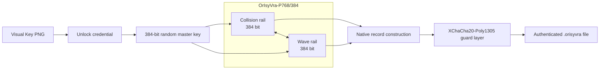

<div align="center">

# OrIsyVra-P768/K384/C384/T256-R18

### Collision–Wave Dual-Engine Authenticated Encryption

Experimental cryptography project and Rust file-encryption application.


<p>
  <a href="https://github.com/urotsuki-san/OrIsyVra/releases/tag/v0.2.0-alpha.1"></a>
  
  
  <a href="LICENSE"></a>
</p>

**[Download](https://github.com/urotsuki-san/OrIsyVra/releases/tag/v0.2.0-alpha.1)** · **[Quick start](#quick-start)** · **[Specification](docs/SPEC.md)** · **[Security](SECURITY.md)** · **[Encrypted drives](#windows-encrypted-drives)**

</div>

> [!IMPORTANT]
> Guarded Mode is the default for normal data. Native Research Mode exposes the experimental OrIsyVra construction for analysis.
>
> `P768`, `K384`, `C384`, `T256`, and `R18` are construction parameters. Native Research Mode has no claimed concrete security level.

## Overview

OrIsyVra currently provides:

- file and folder encryption on Windows, Linux, and macOS;
- Guarded Mode using the Native construction with an independent XChaCha20-Poly1305 layer;
- Native Research Mode for direct analysis of the OrIsyVra construction;
- Visual Key PNG files with a random 384-bit master key;
- Windows four-digit PIN cards backed by a DPAPI-protected 256-bit device secret;
- WinSpd-backed encrypted drives on Windows;
- reduced-round analysis tools for diffusion, differential sampling, and short-cycle searches.

The project is a research alpha. Use Guarded Mode for practical testing and keep independent backups of important data.

## Download

| Platform | Package | Included |
|---|---|---|
| Windows x86-64 | [`OrIsyVra-Setup-x86_64.exe`](https://github.com/urotsuki-san/OrIsyVra/releases/tag/v0.2.0-alpha.1) | GUI, Encrypted Drives GUI, CLI, analysis tool |
| Linux x86-64 | [release bundle](https://github.com/urotsuki-san/OrIsyVra/releases/tag/v0.2.0-alpha.1) | GUI, CLI, analysis tool |
| macOS Apple Silicon | [release bundle](https://github.com/urotsuki-san/OrIsyVra/releases/tag/v0.2.0-alpha.1) | GUI, CLI, analysis tool |

SHA-256 checksum files are included with the release assets.

## Quick start

### Windows desktop

1. Install `OrIsyVra-Setup-x86_64.exe`.
2. Start OrIsyVra.
3. Create or select a Visual Key.
4. Use a four-digit PIN for a Windows PIN card, or the passphrase for an older key.
5. Drop a file or folder into the GUI.
6. Keep **Guarded** selected and start encryption.

The unlocked master key remains in process memory until **Lock** or application exit. The selected key path may be remembered; the PIN is not stored.

### Command line

```bash
orisyvra keygen -o my-key.png
orisyvra encrypt report.pdf --key my-key.png
orisyvra decrypt report.pdf.orisyvra --key my-key.png
```

## Windows PIN cards

A Windows PIN card combines the Visual Key PNG, a four-digit PIN, and a random 256-bit device secret protected by Windows DPAPI. The PIN is not used as the sole key material.

The PNG stores the protected key capsule and non-secret identifiers. The DPAPI-protected device secret is stored under the current Windows user profile. Copying the PNG to another Windows account does not copy that binding.

A deterministic Key Sigil is shown as a visual identifier. It is not secret and is not used for authentication.

See [`docs/PIN_CARDS.md`](docs/PIN_CARDS.md) and [`docs/THREAT_MODEL.md`](docs/THREAT_MODEL.md).

## Windows encrypted drives

The Windows installer includes **OrIsyVra Encrypted Drives** and the WinSpd mount host.

1. Open **OrIsyVra Encrypted Drives**.
2. Press **Connect** for a registered drive.
3. Unlock the associated key if required.
4. Open the mounted drive in Explorer.
5. Use **Safely disconnect** before moving the backing file or intentionally detaching the volume.

New volumes use sparse backing files. A 100 GiB logical volume therefore grows on disk as encrypted blocks are written. The first attachment requires one NTFS or exFAT format operation in Windows.

```text
Explorer / applications
        │
        ▼
Windows NTFS / exFAT
        │
        ▼
WinSpd virtual SCSI disk
        │
        ▼
OrIsyVra authenticated block layer
        │
        ▼
vault.orisyvra-volume
```

WinSpd is an external runtime. Real-machine interoperability and endurance testing are still in progress.

See [`docs/VOLUME.md`](docs/VOLUME.md) and [`docs/WINDOWS_AUTOMOUNT.md`](docs/WINDOWS_AUTOMOUNT.md).

## Cryptographic architecture



| Parameter | Value |
|---|---:|
| State | 768 bit |
| Collision rail | 384 bit |
| Wave rail | 384 bit |
| Master key | 384 bit |
| Capacity | 384 bit |
| Native tag | 256 bit |
| Full rounds | 18 |
| Default chunk | 1 MiB |
| Claimed Native security | None |

## Modes

| Mode | Use | Construction |
|---|---|---|
| **Guarded** | Normal use and practical testing | OrIsyVra Native + XChaCha20-Poly1305 |
| **Native Research** | Cryptanalysis and algorithm research | OrIsyVra Native only |

Native Research Mode requires explicit acknowledgement in the GUI and CLI.

## Native construction status

The Native file format derives separate keys for Record-SIV, stream generation, header binding, and manifest authentication. Record index and plaintext length are included in each record context. The final manifest authenticates total length, record count, and the SHA-384 transcript of the container.

These properties do not establish a concrete security level for the P768 permutation. External cryptanalysis and stronger trail analysis remain open work.

```bash
cargo run --release -p orisyvra-analysis -- diffusion
cargo run --release -p orisyvra-analysis -- differential --rounds 4
cargo run --release -p orisyvra-analysis -- short-cycles --rounds 3
```

## Validation

The release workflow performs:

- workspace tests on Windows, Linux, and macOS;
- release builds on all three platforms;
- Windows binary and installer checks;
- Microsoft Defender scanning on the hosted Windows runner when available;
- SHA-256 checksum generation;
- release asset verification.

This validates the build and packaging path. It is not external cryptographic validation.

<details>
<summary><strong>Build from source</strong></summary>

```bash
git clone https://github.com/urotsuki-san/OrIsyVra.git
cd OrIsyVra
cargo install --path crates/orisyvra
cargo install --path crates/orisyvra-gui
```

Windows:

```powershell
.\scripts\install.ps1
```

Linux / macOS:

```bash
./scripts/install.sh
```

</details>

## Documentation

- [`docs/SPEC.md`](docs/SPEC.md) — specification
- [`docs/THREAT_MODEL.md`](docs/THREAT_MODEL.md) — threat model
- [`docs/PIN_CARDS.md`](docs/PIN_CARDS.md) — Windows PIN cards
- [`docs/VOLUME.md`](docs/VOLUME.md) — encrypted-volume design
- [`docs/WINDOWS_AUTOMOUNT.md`](docs/WINDOWS_AUTOMOUNT.md) — Windows automatic mounting
- [`docs/RESEARCH.md`](docs/RESEARCH.md) — research references
- [`docs/ROADMAP.md`](docs/ROADMAP.md) — roadmap
- [`docs/USAGE_JA.md`](docs/USAGE_JA.md) — 日本語ガイド
- [`SECURITY.md`](SECURITY.md) — security policy

## Status

**v0.2.0-alpha.1 · research alpha**

Native Research Mode has no claimed concrete security strength. Windows PIN cards and encrypted drives are alpha features and still require broader real-machine testing.

## License

[MIT](LICENSE)
